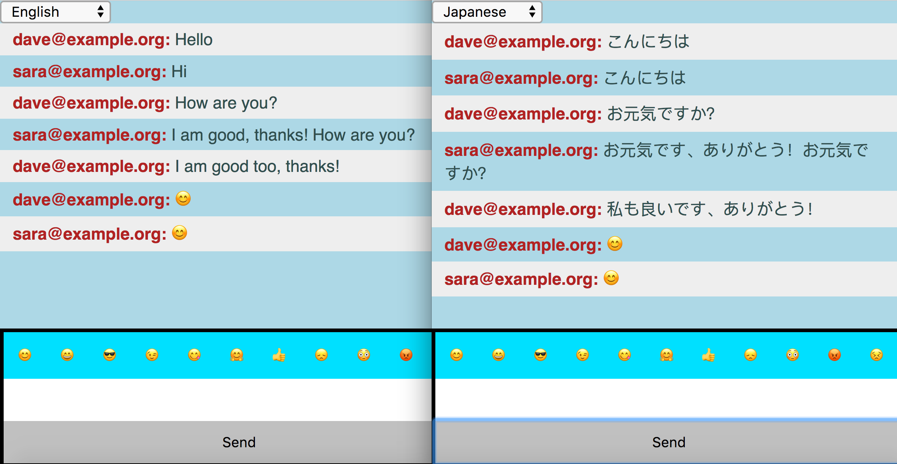
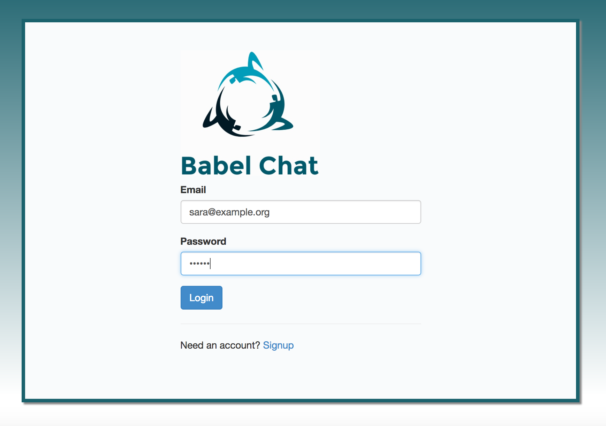

# BabelChat

Instant multi-lingual messaging.
It allows people to talk to each other in a variety of languages, each user
experiencing the same conversation in their own language.

BabelChat is built upon:
 * [Google Translate API for Node.js](https://github.com/Localize/node-google-translate)
 * [Node.js](https://nodejs.org/)
 * [Express](http://expressjs.com/)
 * [React](https://facebook.github.io/react/)
 * [Passport](http://passportjs.org/)
 * [MongoDB](https://www.mongodb.com/)
 * [webpack](https://webpack.js.org/)

## Architecture


## Installation Instructions

 * Install [Node.js](https://nodejs.org/) and npm.
 * Install [MongoDB](https://www.mongodb.com/).
 * Retrieve the repository and install dependencies.
```bash
$ git clone git@github.com:panteha/BabelChat.git
$ cd BabelChat
$ npm install
```
 * Obtain a [Google Translation API](https://cloud.google.com/translate/) key.
 * Set up the environment:
```bash
$ export PATH=$PWD/node_modules/.bin:$PATH
$ export TRANSLATE_KEY=<GOOGLE TRANSLATE API KEY>
$ export DATABASE_DEVELOPMENT=mongodb://<username>:<password>@<hostname>:<port>/babelchat
$ export DATABASE_TEST=mongodb://<username>:<password>@<hostname>:<port>/babelchat-test
 ```
 * Build React frontend
```bash
$ webpack
```

## Running the app locally

```bash
$ npm start
```
then visit `http://localhost:3000/`

## Running tests

```bash
$ npm test
```

## Heroku set up
To run on Heroku, the app requires a MongoDB to be hosted somewhere else.
We have used [mlab](https://www.mlab.com/) previously.

To set up the Google Translate API and MongoDB for Heroku
```bash
$ heroku config:set TRANSLATE_KEY=$TRANSLATE_KEY
$ heroku config:set DATABASE_DEVELOPMENT=mongodb://<username>:<password>@<hostname>.mlab.com:<port>/babelchat
```

## Contributors

 * [Panteha Ahmadi](https://github.com/panteha)
 * [Ian Simpson](https://github.com/Simo72)
 * [Andrew Clarke](https://github.com/Dino982)
 * [Spencer Barton-Fisher](https://github.com/spencerbf)
 * [Aaron Rodrigues](https://github.com/AaronRodrigues)
 * [Elena Morton](https://github.com/elenamorton)
